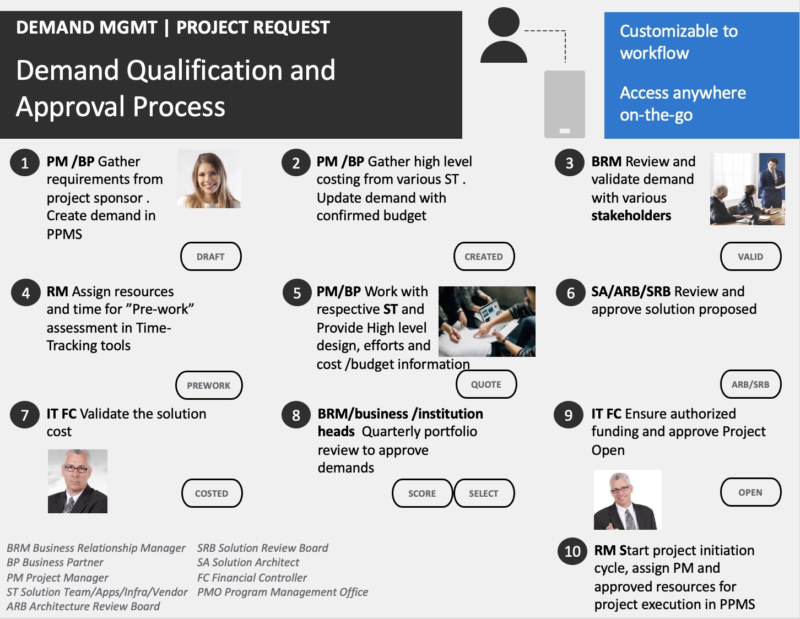

# Project Portfolio Management System PPMS - Version 1A

### Common Problems
1. Project request (aka "demand”) is commonly recorded in excel, SharePoint or outdated application with no integration with other project management functions.   
2. Requestor or PM need to update the same demand information in different systems        
3. Approval process and status reporting are inefficient with emails, powerpoint,  standalone chat apps or forums with the same information presented in different forms.
4. High amount of unproductivity efforts & administrative cost to kick-off or deliver projects

### Benefits of PPMS
- Enable collaboration and fast decision making on Project Request (aka "demand")
- Allow data retrieval or data auto-populate in subsequent project management function in the same application 
- Improve user experience and operation efficiency

### Features
- Demand Management
- Resource Management ("RM")
- Program & Project Delivery
- Reporting functions

Project Request will be available in version 1 as follows : 

| SN | Key Features | Available (Y/N) |
|:--------:|:--------|:----------------:|
| 1 | New user registration | Y |
| 2 | Login | Y |
| 3 | Logout | Y |
| 4 | User profile display | Y |
| 5 | Change of user profile and password | Y |
| 6 | Photo upload | Next version  |
| 7 | Dashboard of modules in PPMS | Y |
| 8 | Demand creation/edit | Y |
| 9 | Family, grouping, classification of demand | Y |
| 10 | Auto-generation of demand code | Y |
| 11 | Validation of start, go live and end date | Y |
| 12 | Status of demand at different stage of 'Demand Qualification' process | Y |
| 13 | Scoring | Y |
| 14 | Cost forecast | Y |
| 15 | Funding Source | Y |
| 16 | Resources breakdown for subsequent integration with RM and Billing | Y |
| 17 | Auto calculation of IT Cost | Y |
| 18 | Auto cost conversion by differnt currency | Next version |
| 19 | Validation of Cost Forecast, Budget Amount, Resource Cost and Person Day | Next version |
| 20 | Key stakeholders for demand approval | Y |
| 21 | Notification by email on demand created or update | Y |
| 22 | Snapshot of demand status for quick review & decision | Y |
| 23 | Chat function | Y |
| 24 | Email notification to users specified in Chat message | Next version |
| 25 | File attachment | Next version |
| 26 | List of demand created | Y |
| 27 | Search | Next version |
| 28 | History log of demand changes| Next version |
| 29 | User configuration | Next version |
| 30 | Documentation on each PPMS module| Next version |

### Specifications / Technical Details
* Workflow : 

* HTML, CSS, JS, Node JS, Express, MongoDB, MailGun
* Template : BOOTSTRAPMADE https://bootstrapmade.com/nice-admin-bootstrap-admin-html-template/
* References : 
* https://fontawesome.com/icons?d=gallery&q=cogs
* Dates comparison :
function toDate(dateStr) {
  var parts = dateStr.split("-")
  return new Date(parts[2], parts[1] - 1, parts[0])
}
* Heroku : https://project-ppms.herokuapp.com/ 

### Challenges and Approach
- Captures common / basic information required in a general IT demand qualification process
- High testing efforts
- Dates comparison
- Less data validation in version 1
- Code optimization in next version